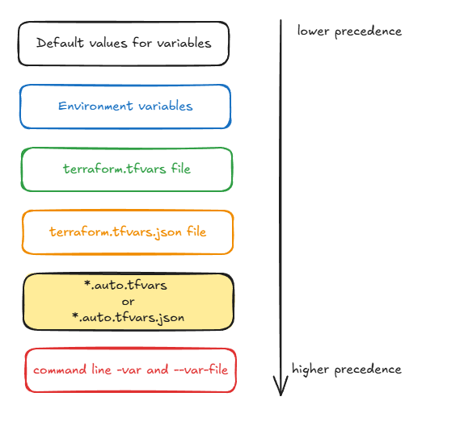

# Variables 

## Customize values based on variables to create reusable and composable code

### Motivation for input variables:
* TO be able to customize aspects of Terraform configurations and modules without having to alter the source code.

### Notes around variables:
* It's convention to declare them inside of variables.tf file, and we use them via var.<NAME>

* When defining a variable, we can se the type, provide a description, give a default value, set sensitive flag to a boolean, and provide validation rules.

* When we run terraform plan or apply and do not provide command-line arguments for the variables, it will ask us to provide the values for each of the variables.
    - If we provide defaults, Terraform will not ask to theses values.

    